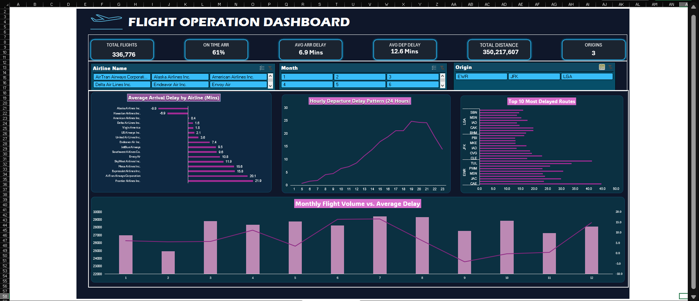
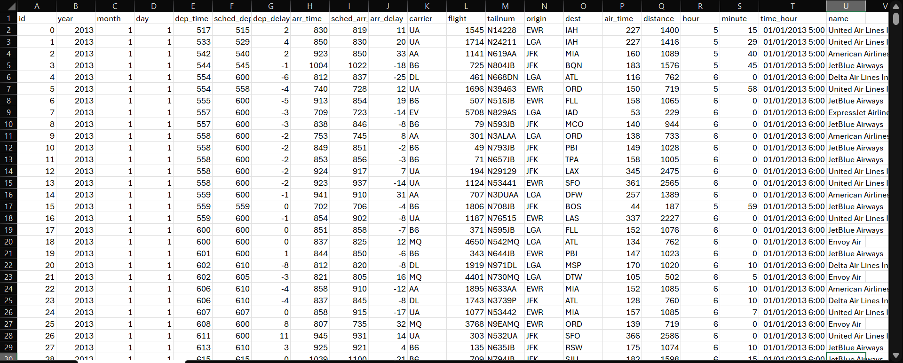
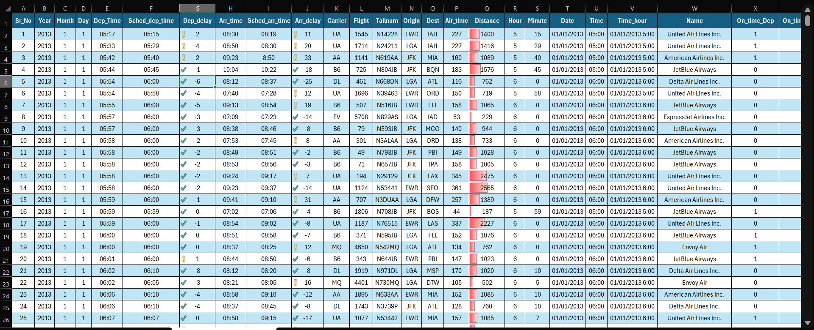
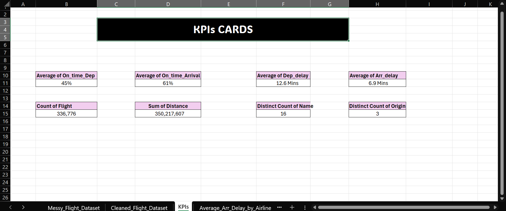
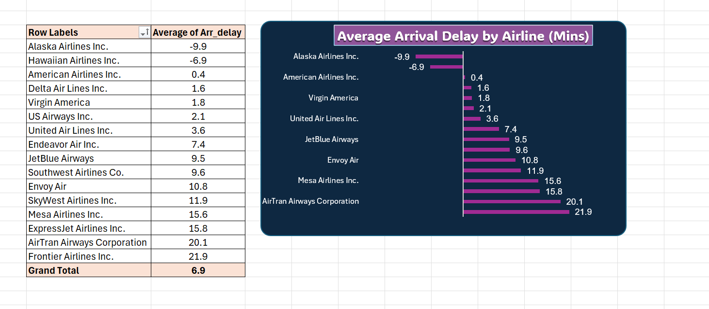
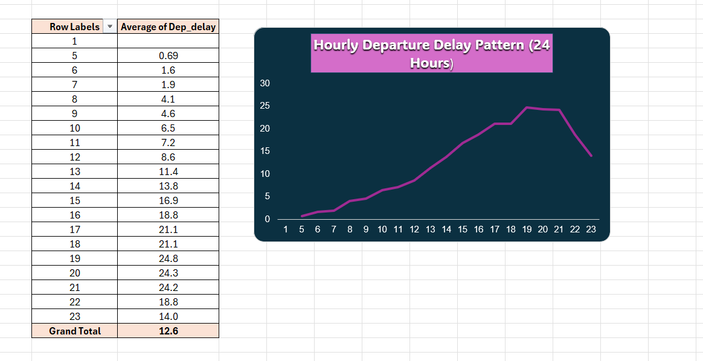
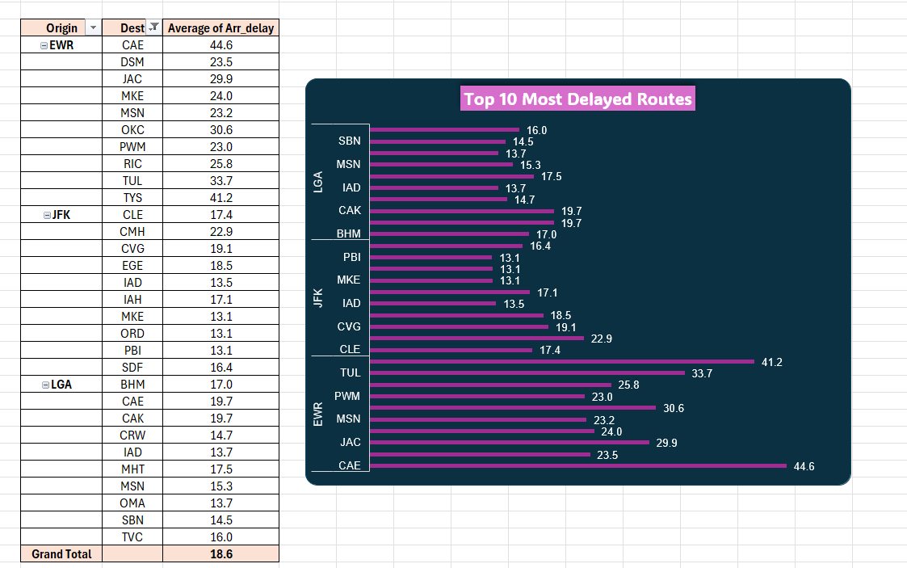
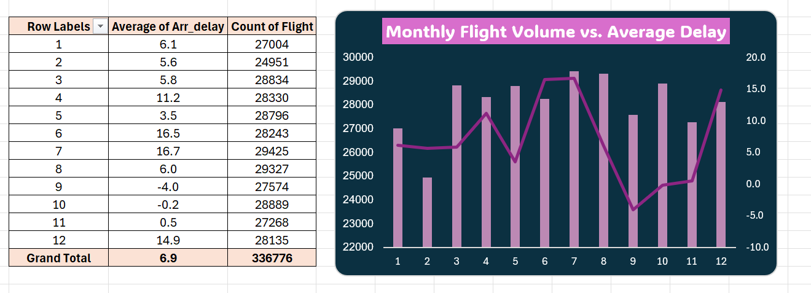

# ✈️ Flight Operations & Delay Performance Analytics Dashboard



An end-to-end data analytics project featuring raw flight data processing, data cleaning & transformation, dynamic KPI Scorecard modeling, and an interactive executive dashboard.

---

## 📸 Interactive Dashboard & Project View Preview

To highlight the full analytics lifecycle, this project showcases the progression from unformatted raw flight data to executive-ready business operational insights.

| Preview | Stage / View | Key Focus & Description |
| :---: | :--- | :--- |
|  | **01. Messy / Raw Data** | Unprocessed operational records with unformatted metrics, raw timestamps, missing values, and inconsistent columns. |
|  | **02. Cleaned & Structured Dataset** | Cleaned dataset with standardized data types, formatted date/time dimensions, conditional formatting, and calculated metrics. |
|  | **03. Dynamic KPI Scorecards** | Backend summary view tracking core operational metrics including Total Flights, On-Time Rates, and Average Delays. |
|  | **04. Executive Dashboard** | Interactive dark-theme presentation dashboard featuring cross-filtering Slicers for Airline Name, Month, and Origin Airport. |

---

## 📊 Analytics & Pivot Chart Breakdowns

Detailed breakdown of the backend aggregations and visual charts powering the executive dashboard insights:

| Visualization | Analytical View | Key Insights & Metric Overview |
| :---: | :--- | :--- |
|  | **Average Arrival Delay by Airline** | Measures performance across 16 commercial carriers. Identifies top-performing airlines vs. high-delay carriers. |
|  | **Hourly Departure Delay Pattern (24 Hours)** | Tracks 24-hour departure delay trends to isolate peak operational bottleneck hours throughout the day. |
|  | **Top 10 Most Delayed Routes** | Isolates the highest-risk flight routes departing from major origin hubs (**EWR**, **JFK**, **LGA**). |
|  | **Monthly Flight Volume vs. Average Delay** | Correlates monthly flight operations against delay averages to assess seasonal capacity strain. |

---

## 💡 Business Problem & Objectives

Flight delays severely impact airline operational efficiency, airport scheduling, and passenger satisfaction across major aviation hubs. Aviation stakeholders needed a centralized business intelligence view to track delay bottlenecks, carrier reliability, and route efficiency.

### Key Objectives:
* **Carrier Performance Tracking:** Analyze average arrival delays across 16 commercial airlines to identify reliable vs. high-risk carriers.
* **Peak Delay Hour Identification:** Evaluate 24-hour departure delay trends to uncover specific hours where flight bottlenecks build up.
* **Route Bottleneck Analysis:** Isolate the top delayed flight routes departing from major origin hubs (**EWR**, **JFK**, **LGA**).
* **Seasonal & Volume Correlation:** Measure monthly flight volumes alongside average arrival delays to assess seasonal operational strain.

---

## 📊 Dataset Overview

The underlying dataset tracks operational performance metrics across major US flight operations with the following main attributes:

* **Temporal Dimensions:** `Year` (2013), `Month` (1–12), `Day`, `Hour`, `Minute`, `Date`, `Time`, `Time_hour`
* **Flight & Carrier Identifiers:** `Carrier`, `Flight`, `Tailnum`, `Name` (Full Airline Name)
* **Route & Location:** `Origin` (EWR, JFK, LGA), `Dest` (Destination Airports), `Distance` (Miles)
* **Delay & Operational Metrics:** `Dep_Time`, `Sched_dep_time`, `Dep_delay`, `Arr_time`, `Sched_arr_time`, `Arr_delay`, `Air_time`, `On_time_Dep`, `On_time_Arr`

### Major Origin Hubs Tracked
* **EWR:** Newark Liberty International Airport
* **JFK:** John F. Kennedy International Airport
* **LGA:** LaGuardia Airport

---

## 🔍 Key Insights & Findings

* **Overall Volume Benchmark:** A total of **336,776 flights** and **350,217,607 miles** were processed across 3 major origin hubs.
* **On-Time Performance:** On-time arrival rate stands at **61%**, while on-time departure rate sits at **45%**.
* **Carrier Delays:** **Frontier Airlines Inc. (21.9 Mins)** and **AirTran Airways Corporation (20.1 Mins)** recorded the highest average arrival delays, whereas **Alaska Airlines Inc. (-9.9 Mins)** and **Hawaiian Airlines Inc. (-6.9 Mins)** operated consistently ahead of schedule.
* **Peak Bottleneck Hours:** Departure delays progressively escalate throughout the day, starting at **0.69 Mins** at 5:00 AM and peaking between **7:00 PM and 9:00 PM (19:00–21:00 Hours)** at **24.8 Mins**.
* **Highest Risk Route:** Routes departing from **EWR to CAE (Columbia Metropolitan)** experienced the highest average arrival delay at **44.6 Mins**, followed by **EWR to TYS (41.2 Mins)**.

---

## 📈 KPIs & Analytical Approach

### 1. Key Metrics & Dynamic Formulas

#### ✈️ Total Flights
$$\text{Total Flights} = \text{COUNT}(\text{Flight}) \quad (336,776 \text{ Flights})$$

#### ⏱️ On-Time Arrival Rate
$$\text{On-Time Arrival Rate} = \text{AVERAGE}(\text{On\time\Arr}) \quad (61\%)$$

#### 🛬 Average Arrival Delay
$$\text{Average Arrival Delay} = \text{AVERAGE}(\text{Arr\delay}) \quad (6.9 \text{ Mins})$$

#### 🛫 Average Departure Delay
$$\text{Average Departure Delay} = \text{AVERAGE}(\text{Dep\delay}) \quad (12.6 \text{ Mins})$$

#### 📏 Total Distance Covered
$$\text{Total Distance} = \sum \text{Distance} \quad (350,217,607 \text{ Miles})$$

#### 🏢 Active Carriers & Origins
$$\text{Carriers} = \text{DISTINCTCOUNT}(\text{Name}) \quad (16) \quad \vert \quad \text{Origins} = \text{DISTINCTCOUNT}(\text{Origin}) \quad (3)$$

---

### 2. Analytical Workflow

1. **Data Cleaning & Standardization:** Handled null flight records, generated calculated flag metrics (`On_time_Dep`, `On_time_Arr`), and mapped carrier codes to full corporate airline names.
2. **Data Transformation & Calculations:** Extracted `Time_hour`, formatted timestamps, and added helper metrics for delay duration calculations.
3. **Pivot Aggregations:** Constructed structured backend summary tables for:
   * Average Arrival Delay by Airline
   * Hourly Departure Delay Patterns (24 Hours)
   * Top Delayed Routes per Origin Hub
   * Monthly Flight Volume vs. Average Delay
4. **Dashboard Development:** Built an interactive Executive Dark-Mode Dashboard (`#0F172A` background with `#38BDF8` Cyan and `#EC4899` Magenta accents).
5. **Dynamic Interactivity:** Connected all visual charts and KPI cards to top interactive Slicers using Excel Report Connections.

---

## 🛠️ Tools & Technologies Used

* **Microsoft Excel**
* Data Cleaning & Transformation
* Advanced Excel Formulas
* Dynamic Pivot Tables & Pivot Charts
* Conditional Formatting
* Executive KPI Cards & Dynamic Shape Reference Linking
* Interactive Cross-Filtering Slicers
* UI/UX Dark Theme Dashboard Design

---

## 🚀 How to Use / Run the Project

### 1. Clone the Repository
```bash
git clone [https://github.com/umer-farooq-analyst/Flights_Operational_Dataset.git](https://github.com/umer-farooq-analyst/Flights_Operational_Dataset.git)
```
---

### 👤 Follow for More Projects

Follow my profile to stay updated with more data projects related to:
* 📊 Data Analytics & Business Intelligence
* 🤖 Machine Learning & AI
* 📈 Interactive Dashboarding & Data Visualization
* 💻 Excel, SQL, and Python Data Workflows

---

### 💬 Feedback Is Always Welcome

Feel free to share your feedback, suggestions, or ideas. Every contribution is highly appreciated! 🙌

> 🌟 **If you found this project helpful, please ⭐ Star the repository and 👤 Follow for more real-world analytics projects!**
